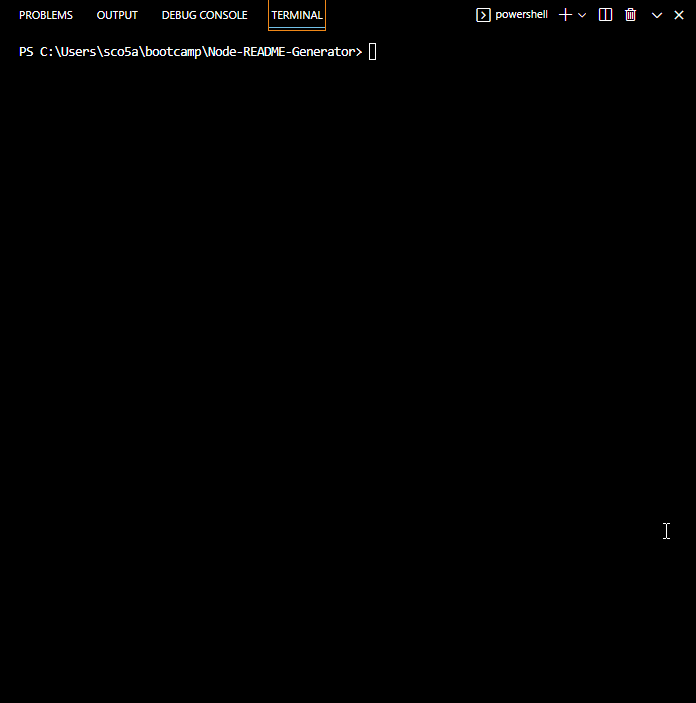

# <Node-README-Generator>

## Description

For this assignment i was tasked with creating a README generator that would function on the command line. This project contains several questions that will be prompted to the user, such as what their project title is and what a good description for their project would be, then passes that information through various diffrent functions to construct a well structured README.md file. 

This assignment helped me to better familiarize myself with Node, as well as using classes and static functions.  

## Usage

This application can be run on the command line, and initialized by typing "node .".

A video walkthrough of the apps functionallity can be viewed below. This generated example README file can be viewed in the utils folder, at /utils/READMEexample.md:

    

## License

MIT License

Copyright (c) [2023] [sco5am]

Permission is hereby granted, free of charge, to any person obtaining a copy
of this software and associated documentation files (the "Software"), to deal
in the Software without restriction, including without limitation the rights
to use, copy, modify, merge, publish, distribute, sublicense, and/or sell
copies of the Software, and to permit persons to whom the Software is
furnished to do so, subject to the following conditions:

The above copyright notice and this permission notice shall be included in all
copies or substantial portions of the Software.

THE SOFTWARE IS PROVIDED "AS IS", WITHOUT WARRANTY OF ANY KIND, EXPRESS OR
IMPLIED, INCLUDING BUT NOT LIMITED TO THE WARRANTIES OF MERCHANTABILITY,
FITNESS FOR A PARTICULAR PURPOSE AND NONINFRINGEMENT. IN NO EVENT SHALL THE
AUTHORS OR COPYRIGHT HOLDERS BE LIABLE FOR ANY CLAIM, DAMAGES OR OTHER
LIABILITY, WHETHER IN AN ACTION OF CONTRACT, TORT OR OTHERWISE, ARISING FROM,
OUT OF OR IN CONNECTION WITH THE SOFTWARE OR THE USE OR OTHER DEALINGS IN THE
SOFTWARE.
